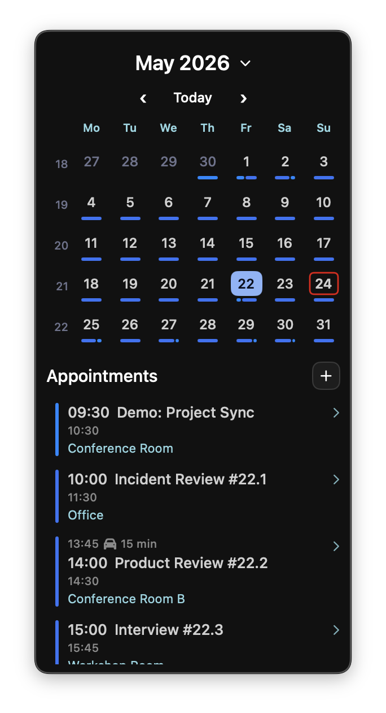

# Soon

Soon is a small macOS menu bar calendar app.

It lives in the official macOS menu bar and gives you quick access to a month calendar or upcoming appointments.

- Left click opens the calendar popup
- Right click opens the app menu
- Calendar access is handled through macOS Calendar permission
- Calendar changes are observed directly while the app is running
- The menu bar label and calendar popup are configurable

## Install

Install from Homebrew:

```bash
brew tap gi8lino/tap
brew install gi8lino/tap/soon
```

Run Soon:

```bash
open "$(brew --prefix)/opt/soon/libexec/Soon.app"
```

If macOS blocks the app with a quarantine warning:

```bash
xattr -dr com.apple.quarantine "$(brew --prefix)/opt/soon/libexec/Soon.app"
open "$(brew --prefix)/opt/soon/libexec/Soon.app"
```

To upgrade:

```bash
brew update
brew upgrade soon
```

To uninstall:

```bash
brew uninstall soon
```

## Permissions

Soon needs Calendar access.

On first launch, macOS should ask for Calendar permission. Soon needs this permission to read events and to create, edit, or delete appointments.

To reset permission and trigger the prompt again:

```bash
tccutil reset Calendar io.github.gi8lino.soon
open "$(brew --prefix)/opt/soon/libexec/Soon.app"
```

Then allow Calendar access in:

```text
System Settings → Privacy & Security → Calendars
```

Without Calendar access:

- the app still opens
- the menu bar item still appears
- calendar events are unavailable
- the popup shows a permission warning

## Configuration

Default config path:

```text
~/.config/soon/config.toml
```

The repository includes `config.default.toml` with the current default values.

Runtime defaults:

```text
lock dir: /tmp/soon
log dir: ~/.local/state/soon
calendar popup mode: month
menu bar label: calendar icon only
debug logging: false
file logging: false
```

Supported environment variables:

- `SOON_CONFIG_PATH`
- `SOON_LOCK_DIR`
- `SOON_LOGGING_ENABLED`
- `SOON_DEBUG`
- `SOON_LOG_DIR`

Example config:

```toml
[logging]
enabled = false
debug = false
directory = "~/.local/state/soon"

[app]
lock_dir = "/tmp/soon"

[menu_bar]
spacing = 4

[menu_bar.icon]
enabled = true
kind = "sf_symbol"
value = "calendar"

[menu_bar.date]
enabled = false
format = "EEE d"

[calendar]
popup_mode = "month"
```

Example environment overrides:

```bash
SOON_CONFIG_PATH=~/.config/soon/config.toml open "$(brew --prefix)/opt/soon/libexec/Soon.app"
SOON_DEBUG=1 open "$(brew --prefix)/opt/soon/libexec/Soon.app"
SOON_LOCK_DIR=/tmp/soon-dev open "$(brew --prefix)/opt/soon/libexec/Soon.app"
```

## Menu bar label

By default, Soon shows only a calendar icon.

Show a date next to the icon:

```toml
[menu_bar.date]
enabled = true
format = "EEE d"
```

Use a different SF Symbol:

```toml
[menu_bar.icon]
enabled = true
kind = "sf_symbol"
value = "calendar.badge.clock"
```

Use a text icon:

```toml
[menu_bar.icon]
enabled = true
kind = "text"
value = "󰃭"
```

Disable the icon and show only a date:

```toml
[menu_bar.icon]
enabled = false

[menu_bar.date]
enabled = true
format = "EEE d"
```

## Calendar mode

Soon supports two popup modes:

- `month`
- `upcoming`

Month mode:

```toml
[calendar]
popup_mode = "month"
```

Upcoming mode:

```toml
[calendar]
popup_mode = "upcoming"

[calendar.upcoming.events]
days = 7
exclude_past_events = true
```

Disable the calendar popup:

```toml
[calendar]
popup_mode = "none"
```

## Calendar config

Common appointment options:

```toml
[calendar.filters]
included_calendar_names = [] # Optional allowlist of visible Calendar.app names. Empty means all calendars are eligible.
excluded_calendar_names = [] # Optional denylist of visible Calendar.app names applied after the allowlist.
included_calendar_ids = [] # Optional advanced allowlist of exact calendar identifiers.
excluded_calendar_ids = [] # Optional advanced denylist of exact calendar identifiers.
included_calendar_source_ids = [] # Optional advanced allowlist of exact calendar source identifiers.
excluded_calendar_source_ids = [] # Optional advanced denylist of exact calendar source identifiers.

[calendar.appointments]
empty_text = "No appointments"
show_calendar_name = false
show_location = true
show_travel_time = true
show_end_time = true
show_alert_icon = false
show_all_day_label = true
show_holiday_all_day_label = false
all_day_label = "All day"
```

Birthday options:

```toml
[calendar.birthdays]
show_birthdays = true
birthdays_show_age = true
birthday_icon = ""
```

Upcoming options:

```toml
[calendar.upcoming.events]
days = 3
exclude_past_events = false

[calendar.upcoming.popup]
background_color = "#111111"
border_color = "#444444"
border_width = 1
corner_radius = 10
padding_x = 10
padding_y = 8
spacing = 8
margin_x = 8
margin_y = 8
```

Month popup style:

```toml
[calendar.month.popup.style]
background_color = "#111111"
border_color = "#444444"
border_width = 1
corner_radius = 10
padding_x = 10
padding_y = 8
spacing = 8
margin_x = 8
margin_y = 8
```

Month calendar style:

```toml
[calendar.month.popup.calendar]
show_week_numbers = true
show_event_indicators = true
header_text_color = "#ffffff"
weekday_text_color = "#91d7e3"
weekday_format = "dd"
day_text_color = "#d0d0d0"
outside_month_text_color = "#6e738d"
today_cell_background_color = "#00000000"
today_cell_border_color = "#ff0000"
today_cell_border_width = 1.4
indicator_color = "#8bd5ca"
```

Month selection style:

```toml
[calendar.month.popup.selection]
selected_text_color = "#0b1020"
selected_background_color = "#89b4fa"
selection_date_format = "yyyy-MM-dd"
selection_date_separator = " - "
allows_range_selection = true
reset_selection_on_third_tap = true
```

Month agenda style:

```toml
[calendar.month.popup.agenda]
layout = "calendar_appointments_vertical"
appointments_scrollable = true
appointments_min_height = 140
appointments_max_height = 240
agenda_title = "Appointments"
max_visible_appointments = 8
```

Month selected-date header:

```toml
[calendar.month.popup.anchor]
date_format = "EEE d MMM"
text_color = "#ffffff"
show_date_text = true
```

Today button:

```toml
[calendar.month.popup.today_button]
title = "Today"
icon = ""
border_color = "#3F2F6B"
border_width = 1.5
```

Composer labels:

```toml
[calendar.composer]
create_title = "New Appointment"
edit_title = "Edit Appointment"
save_label = "Save"
update_label = "Update"
remove_label = "Remove"
cancel_label = "Cancel"
delete_confirmation_title = "Remove appointment?"
delete_confirmation_message = "This action cannot be undone."
```

## Usage

Start Soon:

```bash
open "$(brew --prefix)/opt/soon/libexec/Soon.app"
```

Menu bar interactions:

```text
left click
  open or close the calendar popup

right click
  open app menu
```

The app menu contains:

- Refresh
- Open Calendar Settings
- Open Calendar App
- Quit Soon

Calendar popup actions:

- click `+` to create an appointment
- click an event to edit it
- use Refresh to request a fresh calendar snapshot
- use Today to jump back to the current day in month mode

## How updates work

Soon reads Calendar data directly inside the app process.

While Soon is running, it observes Calendar changes and refreshes its current snapshot when events change. There is no separate calendar agent and no socket connection between the app and the calendar service.

Manual refresh is still useful when:

- the user clicks Refresh
- the visible month changes
- an event is created, updated, or deleted
- Calendar permission changes

## Troubleshooting

Quick checks:

```bash
pgrep -fl Soon
ls -la /tmp/soon
```

Check logs when file logging is enabled:

```bash
tail -n 200 ~/.local/state/soon/soon.out
```

Run with debug logging once:

```bash
SOON_DEBUG=1 open "$(brew --prefix)/opt/soon/libexec/Soon.app"
```

Reset Calendar permission:

```bash
tccutil reset Calendar io.github.gi8lino.soon
open "$(brew --prefix)/opt/soon/libexec/Soon.app"
```

Remove quarantine if macOS blocks the Homebrew-installed app:

```bash
xattr -dr com.apple.quarantine "$(brew --prefix)/opt/soon/libexec/Soon.app"
open "$(brew --prefix)/opt/soon/libexec/Soon.app"
```

Common cases:

- If the menu bar icon does not appear, check whether another Soon instance is already running.
- If the popup opens but shows no events, Calendar permission is usually missing or denied.
- If config changes do not apply, quit and reopen Soon.
- If logging is enabled but no logs appear, check `SOON_LOG_DIR` or `~/.local/state/soon`.

Clean restart:

```bash
pkill -x Soon || true
rm -rf /tmp/soon
open "$(brew --prefix)/opt/soon/libexec/Soon.app"
```

## Development

Build debug:

```bash
swift build
```

Build release:

```bash
swift build -c release
```

Bundle the app locally:

```bash
make bundle
```

Run the local bundled app:

```bash
make run
```

Open the local bundled app manually:

```bash
open dist/Soon.app
```

## Screenshots

### Calendar



### Upcoming


## License

This project is licensed under the Apache 2.0 License. See the `LICENSE` file for details.
